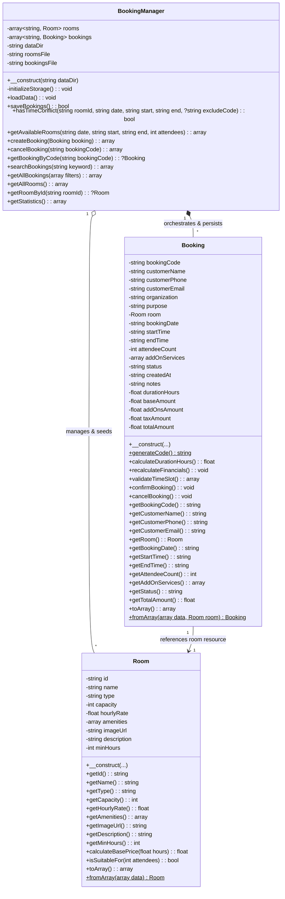
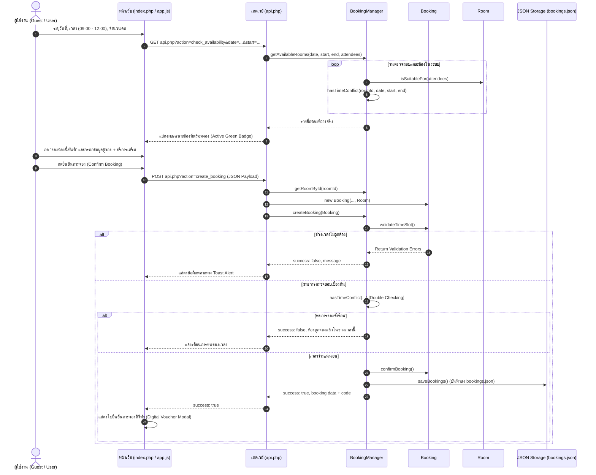
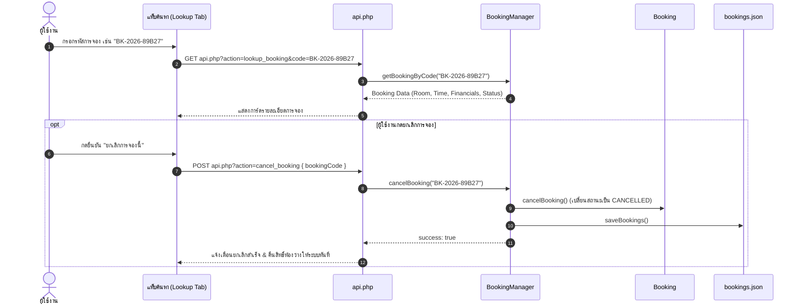

# เอกสารการทำงานระบบ (System & Architecture Documentation)
## โครงการ: ระบบจองห้องประชุมและพื้นที่ทำงานอัจฉริยะ (SpaceHub Booking System)
**รหัสโครงการ:** 035-036  
**รูปแบบสถาปัตยกรรม:** Object-Oriented Analysis and Design (OOAD) & Object-Oriented Programming (OOP) — 3 Main Classes  
**เทคโนโลยีหลัก:** PHP 8.4 (Strict Types), Vanilla JavaScript (ES6+), Vanilla CSS (Glassmorphism), JSON Persistence Database

---

## 1. บทนำและวัตถุประสงค์ของระบบ (System Overview & Objectives)

### 1.1 ความเป็นมาและปัญหาเดิม
ในองค์กร Co-working Space หรือสถาบันการศึกษา การจองห้องประชุมมักประสบปัญหาการจองซ้ำซ้อน (Booking Collisions), ความยุ่งยากในการใช้งานเนื่องจากต้องผ่านขั้นตอนการลงทะเบียนและเข้าสู่ระบบ (Login Friction), และการคำนวณราคาที่ไม่โปร่งใสเมื่อมีการใช้อุปกรณ์เสริมหรือบริการจัดเลี้ยง (Catering)

### 1.2 วัตถุประสงค์ของระบบ SpaceHub
1. **นำไปใช้งานได้จริง (Production-Ready)**: ระบบสามารถให้บริการจอง ตรวจสอบสถานะ คำนวณราคา และออกใบยืนยันการจองดิจิทัล (Digital Voucher) ได้ทันที
2. **ออกแบบตามหลัก OOAD และ OOP อย่างเคร่งครัด**: โครงสร้างหลักประกอบด้วย 3 คลาสที่มีหน้าที่ชัดเจน (Single Responsibility Principle)
3. **ลดอุปสรรคการใช้งาน (No Login Barrier)**: ผู้ใช้สามารถทำรายการจองโดยตรงผ่านรหัสอ้างอิง (Booking Reference Code) ซึ่งใช้ค้นหา แก้ไข หรือยกเลิกการจองได้เอง
4. **ป้องกันการจองเวลาชนกัน 100% (Collision Prevention)**: ใช้อัลกอริทึมตรวจสอบช่วงเวลาว่างแบบคณิตศาสตร์ช่วง (Interval Overlap Algorithm)

---

## 2. การวิเคราะห์และออกแบบเชิงวัตถุ (OOAD: Object-Oriented Analysis & Design)

ระบบได้รับการออกแบบโดยแบ่งความรับผิดชอบออกเป็น 3 คลาสหลักตามบทบาท (Roles & Responsibilities):



### 2.1 รายละเอียดและบทบาทของ 3 คลาส

| ชื่อคลาส | บทบาทตาม OOAD | หลักการ OOP ที่นำมาใช้ | ความรับผิดชอบหลัก |
| :--- | :--- | :--- | :--- |
| **`Room`** | **Entity / Resource Model** | Encapsulation, Information Hiding, Factory Method | จัดเก็บคุณลักษณะของห้องประชุม, ความจุ, อัตราค่าเช่ารายชั่วโมง, และคำนวณราคาขั้นต่ำตามชั่วโมงใช้งาน |
| **`Booking`** | **Entity / Transaction Model** | Encapsulation, Dependency Injection, State Pattern | จัดเก็บข้อมูลธุรกรรมการจอง, ข้อมูลผู้จอง, บริการเสริม, ตรวจสอบความถูกต้องของเวลา และคำนวณราคาสุทธิ (ค่าห้อง + บริการเสริม + VAT 7%) |
| **`BookingManager`** | **Service / Controller / Repository** | High Cohesion, Low Coupling, Data Persistence | บริหารจัดการคลังห้องและรายการจองทั้งหมด, ตรวจจับการจองซ้ำซ้อน (Conflict Detection), บันทึกและดึงข้อมูลจากไฟล์ JSON, และคำนวณสถิติภาพรวม |

---

## 3. ผังลำดับการทำงาน (Sequence Diagrams)

### 3.1 ขั้นตอนการตรวจสอบและทำการจอง (Booking Creation & Conflict Prevention Flow)



### 3.2 ขั้นตอนการค้นหาและขอยกเลิกการจอง (Booking Lookup & Cancellation Flow)



---

## 4. โครงสร้างการจัดเก็บข้อมูล (Data Schema & Storage)

ระบบใช้ไฟล์ JSON เพื่อความสะดวกรวดเร็วในการติดตั้งและใช้งานจริงโดยไม่ต้องพึ่งพา RDBMS ภายนอก:

### 4.1 ไฟล์ `data/rooms.json` (Room Resource Schema)
```json
[
  {
    "id": "R101",
    "name": "Boardroom Alpha",
    "type": "Executive Boardroom",
    "capacity": 16,
    "hourlyRate": 650.0,
    "amenities": [
      "4K Ultra-HD Display (75\")",
      "Polycom Video Conference Bar",
      "Glass Whiteboard",
      "Wireless Presentation",
      "High-Speed Wi-Fi 6",
      "Air Purifier"
    ],
    "imageUrl": "https://images.unsplash.com/photo-1517502884422-41eaead166d4?auto=format&fit=crop&w=800&q=80",
    "description": "ห้องประชุมระดับผู้บริหาร บรรยากาศพรีเมียม เงียบสงบ พร้อมระบบวิดีโอคอนเฟอเรนซ์ระดับมืออาชีพ",
    "minHours": 1
  }
]
```

### 4.2 ไฟล์ `data/bookings.json` (Booking Transaction Schema)
```json
[
  {
    "bookingCode": "BK-2026-89B27",
    "customerName": "Khun Ekkarat Charoensuk",
    "customerPhone": "085-999-1122",
    "customerEmail": "ekkarat.c@innovation.com",
    "organization": "Creative Hub Thailand",
    "purpose": "AI Platform Project Planning Meeting",
    "roomId": "R102",
    "roomName": "Innovation Pod B",
    "roomType": "Team Collaboration",
    "roomRate": 420.0,
    "bookingDate": "2026-09-14",
    "startTime": "09:00",
    "endTime": "12:00",
    "durationHours": 3.0,
    "attendeeCount": 1,
    "addOnServices": [
      {
        "id": "projector_4k",
        "name": "ระบบเชื่อมต่อไร้สาย 4K Wireless ClickShare",
        "price": 350.0,
        "quantity": 1
      },
      {
        "id": "sound_eng",
        "name": "เจ้าหน้าที่เทคนิคประจำห้องคุมระบบภาพ-เสียง",
        "price": 600.0,
        "quantity": 1
      }
    ],
    "status": "CONFIRMED",
    "createdAt": "2026-09-14 10:55:00",
    "notes": "",
    "baseAmount": 1260.0,
    "addOnsAmount": 950.0,
    "taxAmount": 154.7,
    "totalAmount": 2364.7
  }
]
```

---

## 5. คู่มือการติดตั้งและใช้งานระบบ (Installation & Run Guide)

### 5.1 ความต้องการของระบบ (System Requirements)
- PHP เวอร์ชัน 8.0 ขึ้นไป (ทดสอบบน PHP 8.4.24 Strict Types)
- เว็บเบราว์เซอร์มาตรฐาน (Chrome, Edge, Firefox, Safari)

### 5.2 ขั้นตอนการเปิดใช้งานระบบ (Step-by-Step Launch)
1. เปิด Command Prompt หรือ PowerShell ในโฟลเดอร์โปรเจกต์ `c:\Users\camer\035-036\`
2. รันคำสั่งเปิดเครื่องบริการ PHP Built-in Server:
   ```bash
   php -S localhost:8000
   ```
3. เปิดเว็บเบราว์เซอร์แล้วเข้าสู่ URL:
   ```
   http://localhost:8000/index.php
   ```
4. ระบบพร้อมใช้งานได้ทันทีโดยไม่ต้องตั้งค่าฐานข้อมูลหรือลงทะเบียนผู้ใช้
