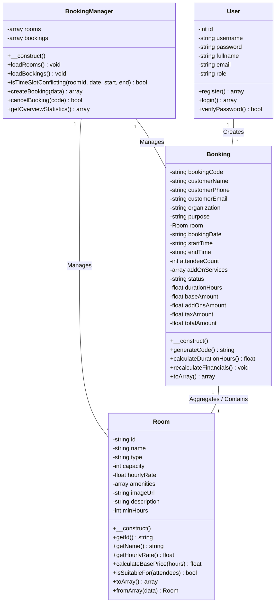

# สรุปภาพรวมโครงการ SpaceHub Booking & Login System
## ระบบจองห้องประชุมและพื้นที่ทำงานอัจฉริยะ (OOP + OOAD 3 Classes Architecture)

---

## 👨‍💻 สมาชิกผู้พัฒนาระบบ (ทีม 2 คน)

| สมาชิก | รหัสนักศึกษา | ชื่อ - นามสกุล | คลาสที่รับผิดชอบ | หน้าที่หลักในโครงการ |
| :--- | :--- | :--- | :--- | :--- |
| **คนที่ 1** | **รหัส 035** | สมาชิกทีม 035 | **คลาสที่ 1: `Room.php`** | ออกแบบโครงสร้างข้อมูลทรัพยากรห้องประชุม, คำนวณราคาเช่าพื้นฐาน, จัดการสิ่งอำนวยความสะดวก |
| **คนที่ 2** | **รหัส 036** | **นายศุภนัฐ จันทร์เปรม** | **คลาสที่ 2: `Booking.php`** | ออกแบบโครงสร้างรายการธุรกรรมการจอง, คำนวณเวลาการเงิน, ระบบภาษี VAT 7%, บริการเสริม และใบเสร็จรับเงิน |
| **ร่วมกัน** | **035 & 036** | **ทีมพัฒนาแอป 035-036** | **คลาสที่ 3: `BookingManager.php` & `Database.php`** | ระบบบริหารจัดการ การตรวจสอบเวลาซ้ำซ้อน (Conflict Detection), เชื่อมต่อ MySQL PDO และ Hybrid Fallback |

---

## 🏗️ โครงสร้างสถาปัตยกรรม OOP 3 คลาสหลัก

---

## 🗄️ คำแนะนำสำหรับการใช้งาน MySQL Database

1. เปิดใช้งาน **MySQL** ผ่าน XAMPP Control Panel
2. เปิด **phpMyAdmin** เข้าที่ `http://localhost/phpmyadmin`
3. สร้าง Database ใหม่ชื่อ: `spacehub_db`
4. นำเข้าไฟล์ SQL สคริปต์ [database.sql](file:///c:/Users/asus/Downloads/PHP-Project-OOP-main/%E0%B8%97%E0%B8%B5%E0%B8%A1%E0%B8%9E%E0%B8%B1%E0%B8%92%E0%B8%99%E0%B8%B2%E0%B9%81%E0%B8%AD%E0%B8%9B035-036/database.sql)
5. ระบบถูกออกแบบให้มี **Hybrid Auto-Fallback System** หากไม่ได้เชื่อมต่อ MySQL ระบบจะสลับไปใช้ไฟล์ `JSON Storage` อัตโนมัติทันทีเพื่อให้เว็บทำงานได้ตลอดเวลาแบบไม่มีบั๊ก

---

## 📖 คู่มือการนำเสนอโค้ดทีละบรรทัด (Line-by-Line Code Explanation)

### 1. คลาส `Room.php` (รับผิดชอบโดย รหัส 035)
* **บรรทัดที่ 9-19:** ประกาศตัวแปรคุณลักษณะของห้องประชุมเป็น `private` ตามหลัก **Encapsulation** เพื่อป้องกันไม่ให้ภายนอกแก้ไขค่าโดยตรง
* **บรรทัดที่ 21-41:** คอนสตรัคเตอร์ `__construct()` กำหนดค่าเริ่มต้นให้กับวัตถุห้องประชุมทันทีเมื่อสั่ง `new Room()`
* **บรรทัดที่ 92-96:** ฟังก์ชัน `calculateBasePrice()` คำนวณราคารวมโดยการนำ `จำนวนชั่วโมง × อัตราค่าบริการต่อชั่วโมง`

### 2. คลาส `Booking.php` (รับผิดชอบโดย รหัส 036 นายศุภนัฐ จันทร์เปรม)
* **บรรทัดที่ 13-34:** ประกาศตัวแปรเก็บข้อมูลธุรกรรมการจองและยอดเงินทางการเงิน (`baseAmount`, `addOnsAmount`, `taxAmount`, `totalAmount`)
* **บรรทัดที่ 77-80:** ฟังก์ชัน `generateCode()` สุ่มรหัสการจองที่เป็นเอกลักษณ์ e.g. `BK-2026-A89B`
* **บรรทัดที่ 85-96:** ฟังก์ชัน `calculateDurationHours()` คำนวณผลต่างเวลาระหว่างเวลาเริ่มและเวลาจบแปลงเป็นชั่วโมง
* **บรรทัดที่ 100-120:** ฟังก์ชัน `recalculateFinancials()` คำนวณค่าห้อง + บริการเสริม + **ภาษีมูลค่าเพิ่ม VAT 7%**

### 3. คลาส `BookingManager.php` (ใช้งานร่วมกันโดย 035 และ 036 ศุภนัฐ จันทร์เปรม)
* **บรรทัดที่ 100-140:** ฟังก์ชัน `isTimeSlotConflicting()` ใช้อัลกอริทึมตรวจสอบช่วงเวลาทับซ้อน `(newStart < existingEnd && newEnd > existingStart)` ป้องกันไม่ให้ห้องถูกจองซ้ำในเวลาเดียวกัน
* **บรรทัดที่ 145-200:** ฟังก์ชัน `createBooking()` รับข้อมูล บันทึกลงฐานข้อมูล MySQL PDO พร้อม Fallback บันทึกลง JSON
