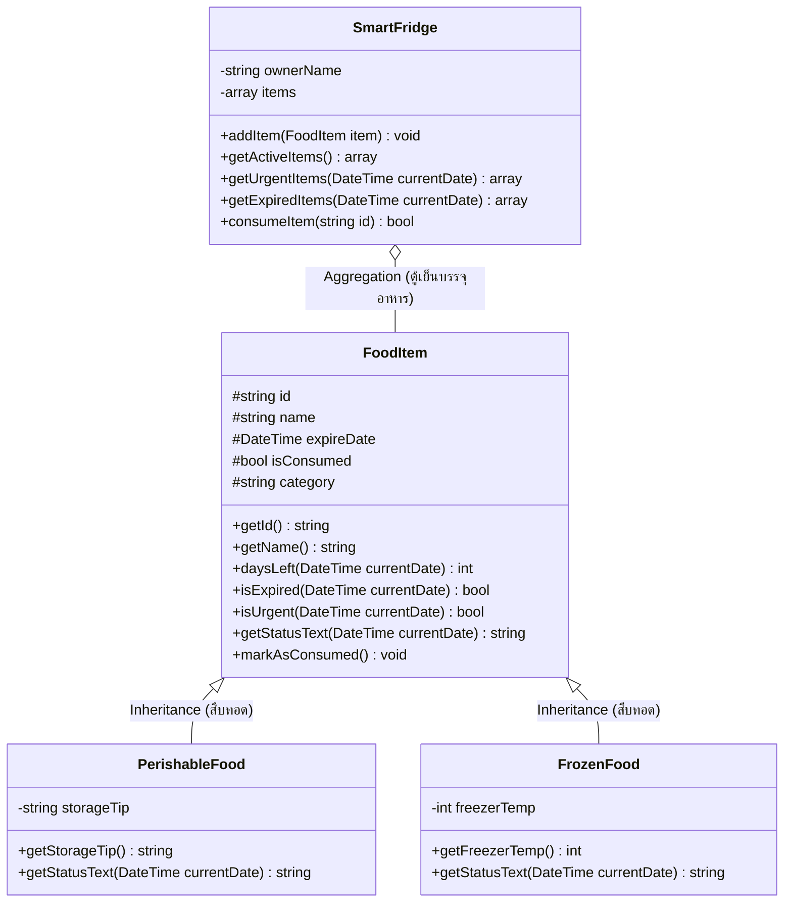

# 📊 เอกสารนำเสนอโครงงาน (Project Presentation)
## SmartFridge: ระบบแจ้งเตือนอาหารในตู้เย็นที่ใกล้จะหมดอายุ (Food Expiry Tracker)
**พัฒนาด้วยภาษา PHP 8 ร่วมกับหลักการเชิงวัตถุ OOP และการวิเคราะห์ออกแบบระบบ OOAD**

---

## 📌 สไลด์ที่ 1: หน้าปกโครงงาน (Title Slide)

* **ชื่อโครงงาน:** SmartFridge: ระบบแจ้งเตือนอาหารในตู้เย็นที่ใกล้จะหมดอายุ
* **ชื่อภาษาอังกฤษ:** SmartFridge: Daily Food Expiry Tracker & Food Waste Reducer
* **เทคโนโลยีหลัก:** PHP 8, OOP (Object-Oriented Programming), OOAD (Object-Oriented Analysis and Design), HTML5, Modern Vanilla CSS
* **แนวคิดสำคัญ:** *"ระบบที่ไม่ซับซ้อน เข้าใจง่าย แต่แก้ปัญหาชีวิตจริงของคนและสิ่งแวดล้อมได้อย่างเป็นรูปธรรม"*

---

## 📌 สไลด์ที่ 2: ที่มาและความสำคัญของปัญหา (Problem Statement)

> *"คุณเคยซื้อของกินมาใส่ตู้เย็น แล้วพบว่ามันเน่าเสียจนต้องโยนทิ้งถังขยะหรือไม่?"*

### ปัญหาในชีวิตประจำวันของมนุษย์:
1. **ภาวะลืมอาหาร (Out of Sight, Out of Mind):** อาหาร ผักสด เนื้อสัตว์ มักถูกวางไว้ลึกในตู้เย็นจนมองไม่เห็น ทำให้ถูกลืม
2. **ขยะอาหาร (Food Waste Crisis):** ในประเทศไทยและทั่วโลก มีอาหารกว่า 30% ถูกทิ้งเป็นขยะโดยไม่ได้บริโภค สร้างก๊าซเรือนกระจกและทำลายสิ่งแวดล้อม
3. **การสูญเสียเงินโดยเปล่าประโยชน์:** แต่ละครัวเรือนสูญเสียเงินค่าอาหารที่ต้องทิ้งโดยเฉลี่ยหลักพันบาทต่อเดือน
4. **ความเสี่ยงต่อสุขภาพ:** การรับประทานอาหารที่หมดอายุโดยไม่รู้ตัว ก่อให้เกิดอาการอาหารเป็นพิษหรือท้องร่วงรุนแรง

---

## 📌 สไลด์ที่ 3: วัตถุประสงค์ของโครงงาน (Project Objectives)

1. เพื่อพัฒนาเว็บแอปพลิเคชันที่ช่วย **ติดตามวันหมดอายุของอาหาร** ในตู้เย็นได้อย่างมีประสิทธิภาพ
2. เพื่อช่วย **คัดกรองเมนูที่ต้องรีบกินด่วน (ภายใน 0-3 วัน)** ให้ผู้ใช้นำไปปรุงอาหารก่อนที่ของจะเน่าเสีย
3. เพื่อประยุกต์ใช้กระบวนการ **OOAD (Object-Oriented Analysis & Design)** ในการวิเคราะห์และออกแบบระบบจากโลกความเป็นจริง
4. เพื่อนำหลักการ **OOP 4 เสาหลัก** (Encapsulation, Abstraction, Inheritance, Polymorphism) มาเขียนโค้ดภาษา PHP 8 ให้เป็นระเบียบ สะอาด และบำรุงรักษาง่าย

---

## 📌 สไลด์ที่ 4: กระบวนการ OOAD (Analysis & Design)

OOAD คือหัวใจของการพัฒนาระบบนี้ โดยแบ่งออกเป็น 2 ขั้นตอน:

```
[ ปัญหาอาหารเน่าคาตู้เย็นในชีวิตจริง ]
                   │
                   ▼
1. OOA (Analysis)   ───► วิเคราะห์หา "ใคร" (Actor: เจ้าของตู้เย็น) และ "วัตถุอะไรบ้าง" (Entities: อาหาร, ตู้เย็น)
                   │
                   ▼
2. OOD (Design)     ───► วาดพิมพ์เขียว (Class Diagram), กฎการนับวันคงเหลือ, การสืบทอดคุณสมบัติ
                   │
                   ▼
3. OOP (Programming)──► ลงมือเขียนโค้ดจริงด้วย PHP 8 ผ่าน 4 เสาหลัก
```

### 1. OOA (Object-Oriented Analysis - การวิเคราะห์ปัญหา)
* **Actor (ผู้ใช้งาน):** เจ้าของบ้าน, สมาชิกในครอบครัว, คนทำอาหาร
* **Entities ที่ค้นพบ:**
  * อาหารทั่วไป (`FoodItem`)
  * ของสดเน่าเสียง่าย (`PerishableFood`)
  * อาหารแช่แข็ง (`FrozenFood`)
  * ตู้เย็นผู้จัดการระบบ (`SmartFridge`)
* **Use Cases หลัก:**
  1. ดูรายการอาหารและของที่ต้องรีบกินด่วน
  2. กด "ทานแล้ว" เมื่อนำอาหารไปบริโภค
  3. บันทึกอาหารใหม่เข้าสู่ตู้เย็น

---

## 📌 สไลด์ที่ 5: แผนภาพโครงสร้างคลาส (OOD: Class Diagram)



---

## 📌 สไลด์ที่ 6: การประยุกต์ใช้ 4 เสาหลักของ OOP (The 4 Pillars of OOP)

| เสาหลัก OOP | นิยาม | จุดที่นำมาใช้จริงใน SmartFridge |
| :--- | :--- | :--- |
| **1. Encapsulation** *(การห่อหุ้ม)* | ซ่อนข้อมูลภายใน และควบคุมการคำนวณผ่าน Method | ตัวแปร `$expireDate` และ `$isConsumed` ถูกควบคุมการเข้าถึง การนับวันคงเหลือทำผ่านเมธอด `daysLeft()` เพื่อป้องกันการแก้ไขตัวเลขมั่วจากภายนอก |
| **2. Abstraction** *(การซ่อนความซับซ้อน)* | ซ่อนสูตรคำนวณเบื้องหลัง ให้ผู้ใช้เรียกใช้คำสั่งง่ายๆ | ผู้ใช้เพียงเรียก `$fridge->getUrgentItems($today)` ระบบจะคัดกรองอาหารที่ต้องรีบกินมาให้ทันที โดยไม่ต้องเขียนลูปเปรียบเทียบวันที่ซ้ำๆ |
| **3. Inheritance** *(การสืบทอดคุณสมบัติ)* | การนำคุณสมบัติคลาสแม่มาใช้ซ้ำในคลาสลูก | คลาส `PerishableFood` (ของสด) และ `FrozenFood` (อาหารแช่แข็ง) สืบทอด Attributes และ Methods จากคลาสแม่ `FoodItem` โดยไม่ต้องเขียนโค้ดซ้ำซ้อน |
| **4. Polymorphism** *(พหุสัณฐาน)* | เมธอดชื่อเดียวกัน แต่ทำงานต่างกันตามชนิดวัตถุ | ทั้ง 3 คลาสมีเมธอด `getStatusText()` ชื่อเดียวกัน แต่ให้ผลลัพธ์ต่างกัน: <br>- `FoodItem`: เตือนปกติทั่วไป<br>- `PerishableFood`: เตือนอย่างเข้มงวดเป็น *"⚡ ของสดวิกฤต!"* <br>- `FrozenFood`: เสริมข้อมูลอุณหภูมิช่องฟรีซ |

---

## 📌 สไลด์ที่ 7: สถาปัตยกรรมการแยกโค้ด (Clean Code Architecture)

ระบบถูกออกแบบโดยแยกโค้ดออกจากกันตามหลัก **Single Responsibility Principle (SRP)**:

```
project_035_002/
│
├── classes/                          # [1. Model Layer: พิมพ์เขียว OOP]
│   ├── FoodItem.php                  # คลาสแม่: อาหารทั่วไป
│   ├── PerishableFood.php            # คลาสลูก: ของสดเน่าเสียง่าย
│   ├── FrozenFood.php                # คลาสลูก: อาหารแช่แข็ง
│   └── SmartFridge.php               # คลาสผู้จัดการ: ตู้เย็น
│
├── includes/                         # [2. Logic & Data Layer: ตรรกะเบื้องหลัง]
│   ├── init_data.php                 # เตรียมข้อมูลตัวอย่างเริ่มต้น และจัดการ Session
│   └── action_handler.php            # จัดการคำสั่งจากฟอร์ม (กินอาหาร, เพิ่มอาหาร, รีเซ็ต)
│
├── style.css                         # [3. Style Layer: ตกแต่งโทนสีธรรมชาติ สบายตา]
│
├── index.php                         # [4. Controller & View: จุดเริ่มต้นระบบและหน้าจอหลัก]
└── PRESENTATION.md                   # [5. เอกสารการนำเสนอฉบับนี้]
```

---

## 📌 สไลด์ที่ 8: การออกแบบส่วนติดต่อผู้ใช้งาน (UI/UX Design)

* **โทนสีสบายตา นุ่มนวล ไม่ฉูดฉาด (Cozy Minimalist & Earth Tones):**
  * **สีพื้นหลัง:** สีขาวนวลตัดเทาอ่อนแบบกระดาษถนอมสายตา (`#f7f9f8`) สบายตา ไม่จ้าตา
  * **สีตัวอักษร:** เทาเข้มชาร์โคล (`#243038`) ลดความเปรียบต่างจัดจ้านของสีดำสนิท ช่วยให้อ่านนานๆ แล้วไม่ล้าสายตา
  * **สีหลัก (Primary):** สีเขียวใบชามัทฉะอบอุ่น (`#2d6a4f`) สื่อถึงธรรมชาติ ความสดใหม่ และความสะอาด
  * **การแจ้งเตือนใกล้หมดอายุ (Urgent):** ใช้สีพีช/แอปริคอทละมุนตา (`#fffaf4` / ขอบ `#fde5ce` / ข้อความ `#944615`) หลีกเลี่ยงสีส้มนีออนสะท้อนแสง
  * **การแจ้งเตือนหมดอายุ (Expired):** ใช้สีชมพูกุหลาบฝุ่นซอฟต์ (`#fdf6f6` / ขอบ `#f9d8d8` / ข้อความ `#9e3232`) นุ่มนวลแต่สังเกตได้ชัดเจน
* **ฟอนต์ภาษาไทย:** ใช้ฟอนต์ **Prompt** (Google Fonts) โค้งมน อ่านง่าย เป็นมิตรกับสายตา
* **ระบบจัดวาง (Layout):** แบ่ง 2 คอลัมน์ชัดเจน มีการ์ดสรุปตัวเลข (Quick Stats) พร้อมปุ่มกดทรงมนนุ่มนวล

---

## 📌 สไลด์ที่ 9: ฟังก์ชันการทำงานหลัก (Key System Features)

1. **ระบบคัดกรองเมนูเร่งด่วน (Urgent Expiry Filter):**
   * แสดงแบนเนอร์เตือนทันทีด้านบนว่ามีวัตถุดิบใดบ้างที่ต้องรีบนำมาทำอาหารภายใน 3 วัน
2. **ปุ่ม "😋 ทานแล้ว" (Consume Action):**
   * เมื่อผู้ใช้นำวัตถุดิบไปปรุงอาหารเสร็จ กดปุ่มนี้เพื่อตัดของออกจากระบบและบันทึกความสำเร็จในการลด Food Waste
3. **ฟอร์ม "+ นำของใหม่เข้าตู้เย็น":**
   * บันทึกอาหารใหม่ พร้อมระบุประเภทตามคลาส OOP (ของสด, ทั่วไป, แช่แข็ง) และกำหนดวันหมดอายุ
4. **โหมดคู่ขนาน (Web UI + CLI Mode):**
   * รองรับการใช้งานผ่านเว็บเบราว์เซอร์ และสามารถรันจำลองการทำงานผ่านหน้าจอ Terminal Command Line (`php index.php`)

---

## 📌 สไลด์ที่ 10: ประโยชน์ที่ได้รับและผลกระทบ (Project Benefits)

1. **ระดับบุคคลและครัวเรือน:**
   * ไม่ลืมอาหาร ประหยัดค่าใช้จ่ายค่าอาหารในแต่ละเดือน
   * ปลอดภัยจากภาวะอาหารเป็นพิษ
2. **ระดับสังคมและสิ่งแวดล้อม:**
   * ช่วยลดปริมาณขยะอาหาร (Food Waste) ที่จะถูกส่งไปยังหลุมฝังกลบ
   * ลดการปล่อยก๊าซมีเทนและคาร์บอนไดออกไซด์จากการเน่าเสียของอาหาร
3. **ระดับการศึกษาด้านซอฟต์แวร์:**
   * เป็นตัวอย่างการประยุกต์ใช้ OOP และ OOAD ที่จับต้องได้จริง โค้ดสะอาด เข้าใจง่าย ไม่ซับซ้อนเกินจำเป็น

---

## 📌 สไลด์ที่ 11: แนวทางการพัฒนาต่อยอดในอนาคต (Future Enhancements)

* 📱 **เชื่อมต่อ LINE Notify / Push Notification:** ส่งข้อความเตือนเข้ามือถือตอนเช้าว่า *"วันนี้มีของอะไรในตู้เย็นต้องรีบกินบ้าง"*
* 📷 **ระบบสแกนใบเสร็จ / บาร์โค้ด (OCR & Barcode Scanner):** ซื้อของจากซูเปอร์มาร์เก็ตแล้วสแกนเข้าตู้เย็นได้ทันที ไม่ต้องพิมพ์เอง
* 🍳 **ระบบแนะนำเมนูอาหาร (Recipe Recommendation):** ดึงวัตถุดิบที่ใกล้หมดอายุมาแนะนำเป็นเมนูทำอาหาร เช่น มีไข่ไก่กับผักสลัด แนะนำทำ *"สลัดไข่ต้ม"*
* 🧊 **IoT Smart Fridge Integration:** เชื่อมต่อกับเซนเซอร์น้ำหนักและกล้องถ่ายภาพภายในตู้เย็น

---

## 📌 สไลด์ที่ 12: สรุปและแนวทางการตอบคำถาม (Defense Q&A Cheat Sheet)

### ❓ คำถามที่ 1: "ทำไมถึงเลือกใช้ OOP กับระบบจัดการตู้เย็น?"
> **แนวทางตอบ:** เพราะอาหารในตู้เย็นมีหลายประเภทที่มีพฤติกรรมต่างกัน (ของสดเน่าเร็ว ของแช่แข็งอยู่นาน อาหารทั่วไป) การใช้ OOP ช่วยให้เราสร้างคลาสแม่ `FoodItem` เก็บสิ่งที่มีร่วมกัน และแตกคลาสลูก `PerishableFood` กับ `FrozenFood` มารองรับความแตกต่างได้โดยโค้ดไม่ซ้ำซ้อน และยังง่ายต่อการเพิ่มอาหารชนิดใหม่ในอนาคต

### ❓ คำถามที่ 2: "ตรงไหนของระบบที่เป็น Polymorphism ชัดเจนที่สุด?"
> **แนวทางตอบ:** คือเมธอด `getStatusText()` ครับ ทั้ง 3 คลาสมีชื่อฟังก์ชันเดียวกัน แต่ให้ผลลัพธ์ต่างกัน:
> - `FoodItem` ส่งข้อความเตือนปกติ
> - `PerishableFood` ส่งข้อความเตือนของสดขั้นวิกฤต
> - `FrozenFood` นำข้อความเดิมมาพ่วงด้วยอุณหภูมิช่องฟรีซ

### ❓ คำถามที่ 3: "Encapsulation ช่วยแก้ปัญหาอะไรในโค้ด?"
> **แนวทางตอบ:** ป้องกันไม่ให้โค้ดส่วนอื่นแก้ไขวันหมดอายุหรือสถานะอาหารมั่วซั่วครับ การคำนวณวันคงเหลือจะถูกกักไว้ในเมธอด `daysLeft()` โดยคำนวณเทียบกับวันที่ปัจจุบันเสมอ ทำให้ข้อมูลถูกต้องและปลอดภัยครับ

---

### 💻 ช่องทางการทดสอบระบบ
* **Web Application:** `http://localhost:8000`
* **CLI Terminal:** `php index.php`
