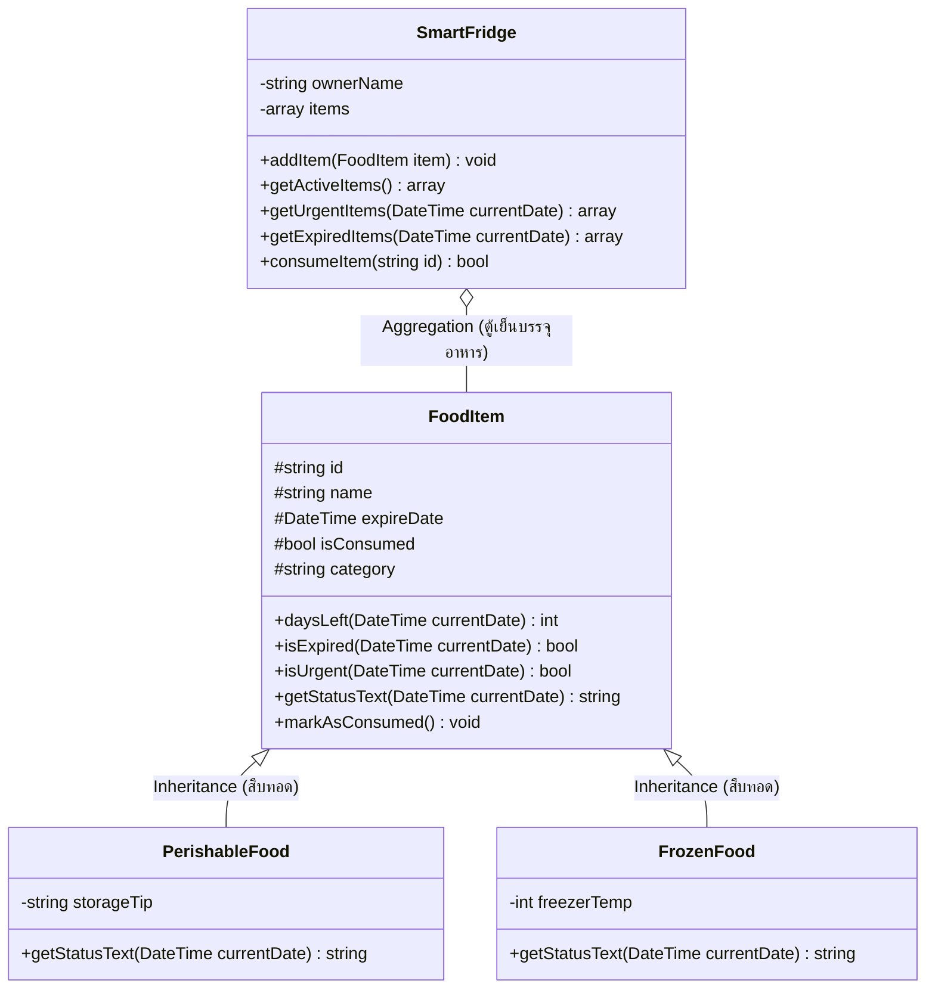

# SmartFridge: ระบบแจ้งเตือนอาหารในตู้เย็นที่ใกล้จะหมดอายุ (Food Expiry Tracker)
> ระบบจัดการและแจ้งเตือนวันหมดอายุของอาหาร พัฒนาด้วยภาษา **PHP 8** โดยประยุกต์ใช้ **OOP (Object-Oriented Programming)** และ **OOAD (Object-Oriented Analysis & Design)**

---

## 1. ปัญหาของคนในชีวิตจริงที่ระบบนี้ช่วยแก้ (The Real Human Problem)

ในชีวิตประจำวัน แทบทุกบ้านต้องเผชิญกับปัญหา:
1. **ซื้อของกินมาตุนในตู้เย็นแล้วลืม:** อาหาร ผักสด เนื้อสัตว์ หรือนม ถูกวางไว้ลึกในตู้เย็นจนมองไม่เห็น
2. **อาหารเน่าเสียคาตู้เย็น (Food Waste):** รู้ตัวอีกทีของก็หมดอายุจนบูดหรือขึ้นรา สุดท้ายต้องโยนทิ้งถังขยะ
3. **สูญเสียเงินโดยเปล่าประโยชน์:** ซื้อของมาด้วยเงิน แต่ไม่ได้กิน ต้องเสียเงินซื้อใหม่ซ้ำซ้อน
4. **ความเสี่ยงต่อสุขภาพ:** หากเผลอรับประทานอาหารที่หมดอายุโดยไม่รู้ตัว อาจเกิดอาการอาหารเป็นพิษหรือท้องร่วงรุนแรง

**การแก้ปัญหาของ SmartFridge:**
* บันทึกรายการอาหารและคำนวณวันหมดอายุอัตโนมัติเปรียบเทียบกับวันปัจจุบัน
* คัดกรองและแสดงแถบเตือนสีส้ม **"🚨 เมนูแนะนำที่ต้องรีบกินด่วน (ภายใน 0-3 วัน)"** เพื่อให้เจ้าของบ้านหยิบมาทำอาหารก่อนที่มันจะเน่าเสีย
* เตือนแถบสีแดงสำหรับ **"❌ ของที่หมดอายุแล้ว"** เพื่อป้องกันการเผลอรับประทาน
* มีปุ่ม **"😋 ทานแล้ว"** เพื่อตัดรายการออกและบันทึกว่าช่วยลดขยะอาหารสำเร็จ

---

## 2. โครงสร้างการแยกไฟล์ของระบบ (System Architecture)

ระบบได้ทำการแยกโค้ดออกจากหน้า `index.php` ให้เป็นสัดส่วนชัดเจนตามหลัก **Separation of Concerns** เพื่อให้โค้ดสะอาด ไม่ปะปนกัน และแก้ไขได้ง่าย:

```
project_035_002/
│
├── classes/                          # [1. Model Layer: พิมพ์เขียว OOP]
│   ├── FoodItem.php                  # คลาสแม่: อาหารทั่วไป
│   ├── PerishableFood.php            # คลาสลูก: ของสดเน่าเสียง่าย
│   ├── FrozenFood.php                # คลาสลูก: อาหารแช่แข็ง
│   └── SmartFridge.php               # คลาสผู้จัดการ: ตู้เย็น
│
├── includes/                         # [2. Logic & Handler Layer: ตรรกะเบื้องหลัง]
│   ├── init_data.php                 # เตรียมข้อมูลตัวอย่างเริ่มต้น และจัดการ Session
│   └── action_handler.php            # ประมวลผลคำสั่งฟอร์ม (ทานอาหาร, เพิ่มอาหาร, รีเซ็ต)
│
├── style.css                         # [3. Style Layer: การตกแต่งและดีไซน์ทั้งหมด]
│
├── index.php                         # [4. Controller & View: จุดเริ่มต้นระบบและหน้าจอหลัก]
└── README.md                         # [5. Documentation: คู่มืออธิบายระบบฉบับเต็ม]
```

---

## 3. รายละเอียดการแยกโค้ด: ส่วนไหนทำอะไร ตรงไหนทำงานอย่างไร

### 🔹 กลุ่มที่ 1: ส่วนพิมพ์เขียวข้อมูลและกฎธุรกิจ (โฟลเดอร์ `classes/`)
* **[classes/FoodItem.php](file:///c:/Users/camer/Downloads/project_035_002/classes/FoodItem.php)**
  * **หน้าที่:** เป็นคลาสแม่หลัก จัดเก็บชื่อ, วันหมดอายุ และมีเมธอด `daysLeft()` คำนวณวันคงเหลือ
* **[classes/PerishableFood.php](file:///c:/Users/camer/Downloads/project_035_002/classes/PerishableFood.php)**
  * **หน้าที่:** สืบทอดจาก `FoodItem` แต่ Override การแจ้งเตือนให้เข้มงวด สำหรับของสดเน่าเสียง่าย
* **[classes/FrozenFood.php](file:///c:/Users/camer/Downloads/project_035_002/classes/FrozenFood.php)**
  * **หน้าที่:** สืบทอดจาก `FoodItem` เพิ่มการระบุอุณหภูมิช่องแช่แข็ง สำหรับอาหารแช่แข็ง
* **[classes/SmartFridge.php](file:///c:/Users/camer/Downloads/project_035_002/classes/SmartFridge.php)**
  * **หน้าที่:** ตัวแทนตู้เย็น ทำหน้าที่รวบรวมอาหาร และมีฟังก์ชัน `getUrgentItems()` เพื่อคัดกรองของที่ต้องรีบกินด่วน

---

### 🔹 กลุ่มที่ 2: ส่วนประมวลผลตรรกะและข้อมูล (โฟลเดอร์ `includes/`)
* **[includes/init_data.php](file:///c:/Users/camer/Downloads/project_035_002/includes/init_data.php)**
  * **หน้าที่:** จัดเตรียมข้อมูลอาหารจำลองเริ่มต้น (Seed Data) และซิงก์ข้อมูลจาก Session ทำให้หน้าเว็บจำสถานะอาหารได้
* **[includes/action_handler.php](file:///c:/Users/camer/Downloads/project_035_002/includes/action_handler.php)**
  * **หน้าที่:** รอรับคำสั่ง HTTP `POST` จากผู้ใช้:
    - ถ้ากด **"😋 ทานแล้ว"** $\rightarrow$ สั่ง `$fridge->consumeItem($id)`
    - ถ้าส่งฟอร์ม **"+ เพิ่มของใหม่"** $\rightarrow$ สร้าง Object ตามประเภทแล้วสั่ง `$fridge->addItem($newItem)`
    - ถ้ากด **"🔄 รีเซ็ต"** $\rightarrow$ ล้าง Session คืนค่าเริ่มต้น

---

### 🔹 กลุ่มที่ 3: ส่วนการตกแต่ง (ไฟล์ `style.css`)
* **[style.css](file:///c:/Users/camer/Downloads/project_035_002/style.css)**
  * **หน้าที่:** ควบคุมธีมสี, แถบสถานะ (แดง-ส้ม-เขียว), Glassmorphism และ Responsive Layout เพื่อให้หน้า `index.php` ไม่ถูกบวมด้วยโค้ด CSS

---

### 🔹 กลุ่มที่ 4: หน้าจอแสดงผลและประสานงาน (ไฟล์ `index.php`)
* **[index.php](file:///c:/Users/camer/Downloads/project_035_002/index.php)**
  * **หน้าที่:** เป็น **Entry Point** รวมทุกส่วนเข้าด้วยกัน:
    1. เรียก Autoloader ดึงคลาสจาก `classes/`
    2. เรียก `init_data.php` และ `action_handler.php` เพื่อเตรียมข้อมูล
    3. เชื่อมต่อ `style.css` สำหรับตกแต่ง
    4. เรนเดอร์ HTML ส่วน Header, Quick Stats, รายการอาหาร, และแบบฟอร์มเพิ่มของใหม่

---

## 4. แผนภาพ Class Diagram (Mermaid)



---

## 5. วิธีการทดสอบและรันใช้งาน

### รันผ่านหน้าเว็บ (Web Application)
เปิดเซิร์ฟเวอร์ PHP:
```bash
php -S localhost:8000
```
เปิดเบราว์เซอร์ไปที่: **[http://localhost:8000](http://localhost:8000)**

### รันผ่าน Terminal (CLI Demo)
```bash
php index.php
```
